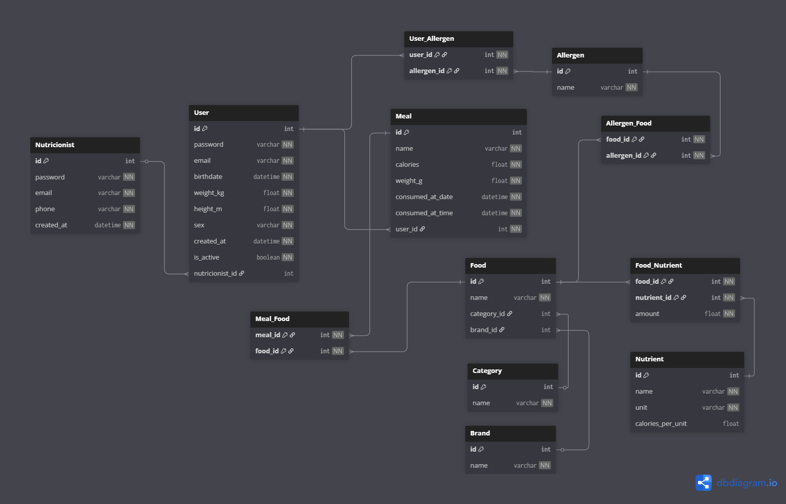

# Smart Balance Backend
Backend of the Smart Balance developed as a Capstone project for university, UNISANTA. 

## Minimum System Requirements

- Git
- Python 3.14+
- Python3-venv (Linux/Mac)
- PostgreSQL

## Quick Start

Set up the application on your computer in 6 steps:

1. Create a `.env` file in the root folder of the application with the following information 

```properties
SQLALCHEMY_DATABASE_URL="postgresql://<your_user>:<your_password>@<host>:<port>/<database_name>"
```

2. Create a python virtual environment: `python -m venv .venv`.
3. Activate the virtual environment using `source .venv/bin/activate` (on Linux/Mac) or just `.venv\Scripts\activate` (on Windows).
4. Install the dependencies running `pip install -r requirements.txt`.
5. Run `python script.py` to create the database.
6. Start the application using `fastapi run main.py`.

## Database Diagram



<details>
<summary>Diagram dbdiagram lang</summary>

```SQL
Table Nutricionist {
  id          int       [pk, increment]
  password    varchar   [not null]
  email       varchar   [not null]
  phone       varchar   [not null]
  created_at  datetime  [not null]
}

Table User {
  id               int       [pk, increment]
  password         varchar   [not null]
  email            varchar   [not null]
  birthdate        datetime  [not null]
  weight_kg        float     [not null]
  height_m         float     [not null]
  sex              varchar   [not null]
  created_at       datetime  [not null]
  is_active        boolean   [not null]
  nutricionist_id  int       [ref: > Nutricionist.id, null]
}

Table Meal {
  id                int       [pk, increment]
  name              varchar   [not null]
  calories          float     [not null]
  weight_g          float     [not null]
  consumed_at_date  datetime  [not null]
  consumed_at_time  datetime  [not null]
  user_id           int       [not null, ref: > User.id]
}

Table Food {
  id           int     [pk, increment]
  name         varchar [not null]
  category_id  int     [ref: > Category.id, null]
  brand_id     int     [ref: > Brand.id, null]
}

Table Brand {
  id    int     [pk, increment]
  name  varchar [not null]
}

Table Category {
  id    int     [pk, increment]
  name  varchar [not null]
}

Table Nutrient {
  id                int     [pk, increment]
  name              varchar [not null]
  unit              varchar [not null]
  calories_per_unit float   [null, default: 0.0]
}

Table Allergen {
  id    int     [pk, increment]
  name  varchar [not null]
}

// Many-to-Many: User <-> Allergen
Table User_Allergen {
  user_id     int [not null, ref: > User.id]
  allergen_id int [not null, ref: > Allergen.id]

  indexes {
    (user_id, allergen_id) [pk]
  }
}

// Many-to-Many: Meal <-> Food
Table Meal_Food {
  meal_id int [not null, ref: > Meal.id]
  food_id int [not null, ref: > Food.id]

  indexes {
    (meal_id, food_id) [pk]
  }
}

// Many-to-Many: Food <-> Nutrient (com campo extra)
Table Food_Nutrient {
  food_id     int   [not null, ref: > Food.id]
  nutrient_id int   [not null, ref: > Nutrient.id]
  amount      float [not null]

  indexes {
    (food_id, nutrient_id) [pk]
  }
}

// Many-to-Many: Allergen <-> Food
Table Allergen_Food {
  food_id     int [not null, ref: > Food.id]
  allergen_id int [not null, ref: > Allergen.id]

  indexes {
    (food_id, allergen_id) [pk]
  }
}
```

</details>